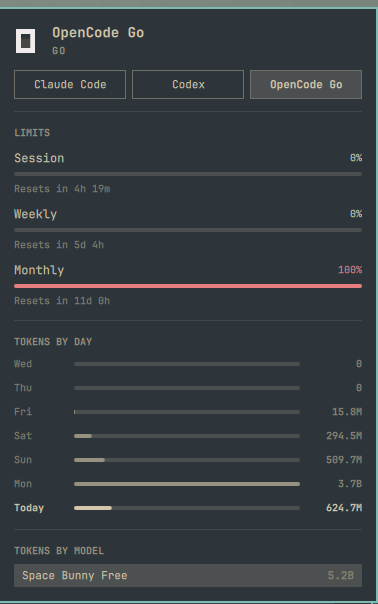

# OpenCode Go Watcher

**OpenCode Go usage and rate limits in the Omarchy agents panel.**

Omarchy's bar already has a panel that tracks your AI coding subscriptions —
plan, percentage of each allowance used, tokens by day, tokens by model. It
ships collectors for Claude Code, Codex, and Fireworks. OpenCode Go is not one
of them, and it cannot simply be dropped in: the built-in collectors are invoked
by `omarchy-agent-usage-update`, which only ever looks inside the omarchy
package's own `bin/`. This plugin fills the gap and adds an **OpenCode Go** tab
next to the others.

Runs on **Omarchy 4**.



*The OpenCode Go tab. The logo is the optional extra described below — without
it the tab falls back to the panel's bar glyph and looks the same otherwise.*

## What it shows

- **Rate limits** — the percentage used of each window OpenCode Go meters you
  on, and the time until it resets: the rolling 5-hour, the weekly, and the
  monthly.
- **Tokens by day** — one row per day for the last week, today bolded.
- **Tokens by model** — the input / output / cache split, scaled to the heaviest
  model.
- **Prompts and sessions** — today, and all time across every active day.

The monthly window is the one that bites. The 5-hour and weekly meters can both
read zero while you are actually capped, because a free model burns rolling
budget without touching the monthly allowance; only the monthly meter tells the
truth.

## Install

```bash
omarchy plugin add https://github.com/villenull/OpenCodeGoWatcher --enable
```

That is the entire install. `omarchy plugin update` keeps the checkout current,
so there is a single copy on disk.

Then sign in to OpenCode Go if you have not already — `opencode auth login`, or
any `opencode-go` model in opencode itself. The tab appears on the next
refresh; press `r` in the panel, or wait for the next publish.

Requires Python 3.11+ (both omarchy's own collectors and this one use it) and
`jq`, which Omarchy already requires. Nothing else to install: the backend is
stdlib-only.

### The tab has no logo

The panel draws a provider's mark from `assets/<id>.svg` inside its own
directory, which for the built-in panel is a path the omarchy package owns.
Shipping a logo would mean shipping a fork of the panel, and a fork does not
receive upstream fixes — a bad trade for one icon. So this tab falls back to
the panel's own bar glyph, which is the documented behaviour for a provider
that ships no mark.

If you want the OpenCode mark anyway, and accept maintaining the fork:

```bash
omarchy plugin clone omarchy.agents
cp ~/.config/omarchy/plugins/villenull.agents/assets/opencode-go{,-light}.svg \
   ~/.config/omarchy/plugins/villenull.agents/assets/
```

Undo it with `omarchy plugin remove villenull.agents`, which puts
`omarchy.agents` back in the bar; the OpenCode Go tab survives either way.

## How it works

`omarchy.agents` is strictly a display. It watches
`~/.local/state/omarchy/agents/usage/` and draws whatever records it finds
there — a record that appears in that directory is an agent, whoever wrote it.
So this plugin writes a record and stays out of the panel's way; the panel
itself is never modified.

A five-minute service runs the collector and publishes the result atomically.
The collector reads two places:

| Field | Source |
|---|---|
| Tokens, prompts, sessions, models | `~/.local/share/opencode/opencode.db` — every `role: "assistant"` message whose `providerID` is exactly `opencode-go` |
| Rate-limit windows | `GET https://opencode.ai/zen/go/v1/usage`, authenticated with the key from `OPENCODE_API_KEY` or opencode's own `auth.json` |

Provider matching is exact, as it is in the built-in claude and codex
collectors: an `opencode-go-proxy` gateway or a plain `opencode` provider is a
different subscription and stays out. That is also why this plugin has to exist
at all — the built-in collectors do scan `opencode.db`, but only for the
`anthropic` and `openai` providers, so OpenCode Go's usage was previously
counted nowhere.

### Performance

opencode's database is large — tens of gigabytes on a machine that has been
coding for a while — so the scan is not free. Two things keep it cheap:

- The SQL query filters with `LIKE` gates and `json_extract` before any row
  reaches Python, so non-matching JSON is never parsed. A cold scan over a 16 GB
  database takes about 0.6 s.
- The result is cached in `~/.cache/omarchy/agent-usage/`, keyed by database
  path and stamped with the day it was taken, so `--limits-only` can reuse a
  scan for 15 minutes and a normal run reuses one only long enough (20 s) to
  dedup two collectors racing.

## Commands

`bin/` is not on `PATH`, so the plugin path is spelled out:

```bash
# what the panel is currently drawing
~/.config/omarchy/plugins/io.github.villenull.opencode-go-watcher/bin/opencode-go-watcher-status

# ...after collecting fresh data
.../bin/opencode-go-watcher-status --refresh

# the raw record
.../bin/opencode-go-watcher-status --json

# publish now instead of waiting for the timer
.../bin/opencode-go-watcher-publish

# the collector on its own: one display-ready JSON record on stdout
.../bin/opencode-go-watcher-usage
.../bin/opencode-go-watcher-usage --force        # rescan past the cache
.../bin/opencode-go-watcher-usage --limits-only  # fresh limits, cached stats
```

`opencode-go-watcher-status` reads the published record rather than collecting,
so asking a question does not cost a walk over the database. `--refresh` is the
only way to see a window that moved since the last publish.

`OPENCODE_GO_USAGE_URL` overrides the usage endpoint, which is how the test
exercises the limits handling without a network.

## When the tab is missing

The panel hides an agent that has produced no numbers, so an empty tab usually
means one of:

- **Not signed in.** No key in `auth.json` and no `OPENCODE_API_KEY`. The
  collector says so in the record's `authHelpText`; the panel shows that line.
- **No OpenCode Go usage yet.** The tab appears the moment a scan finds one
  assistant message on the `opencode-go` provider.
- **Disabled in the widget settings.** The publisher reads the panel's own
  per-agent switch and stops writing, so re-enabling there is enough:

  ```bash
  omarchy bar set omarchy.agents providers '{
    "claude": { "enabled": true },
    "codex": { "enabled": true },
    "fireworks": { "enabled": true },
    "opencode-go": { "enabled": true }
  }' --json
  ```

`omarchy-shell omarchy.agents refresh` forces a republish of the other three
and makes the panel rescan for records, which is the fastest way to make a
missing tab appear once the data is there.

## Tests

```bash
./test/usage-test.sh
```

Sixteen assertions over a throwaway fixture: that the collector counts
`opencode-go` messages and nothing that merely looks like one, that reasoning
folds into output while cache stays separate, that a corrupt row does not abort
a scan, that the cache is reused by `--limits-only` and bypassed by `--force`,
and that percentages arriving as `0..100` leave as `0..1`. The network is
stubbed, so the suite never depends on a live subscription or on the developer's
own usage.

## Provenance

The collector is ported from
[basecamp/omarchy#7157](https://github.com/basecamp/omarchy/pull/7157), an open
pull request adding OpenCode Go support to the built-in panel. It is not merged,
and several rival PRs cover the same ground, so it may never be. If it lands
upstream, this plugin becomes redundant — `omarchy plugin remove
io.github.villenull.opencode-go-watcher` and the stock collector takes over the
same tab, because both write the same `opencode-go` record.

One change from upstream: the stale-limits cache drops windows whose reset time
has already passed, so an outage cannot leave a meter describing an allowance
that has since reset.

## License

[MIT](LICENSE).
